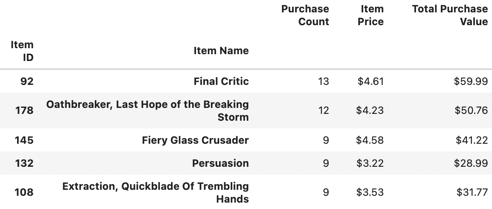

<!DOCTYPE html>
<html>

<h3>
    pandas-challenge

<h2>
    Player Count

    Heroes of Pymoli has 576 players which use the in-game Marketplace.
    

<h2>
    Purchasing Analysis (Total)
</h2>
     
    
<h2>
    Gender Demographics
</h2>
    

        We can see that male is the primary gender option choosen for accounts, which might suggest a factor preventing a more traditional spread of data over a gender spectrum.
    
   </img>
    

   
</h2>    
<h2>
    Purchasing Analysis (Gender)
</h2>    
     

<h2>
    Age Demographics
</h2>
     
     

<h2>
    Top Spenders
</h2>    
     

<h2>
    Most Popular Items
</h2>
     
<h2>
    Most Profitable Items
</h2>   
     
 </h2>   
    
</html>
