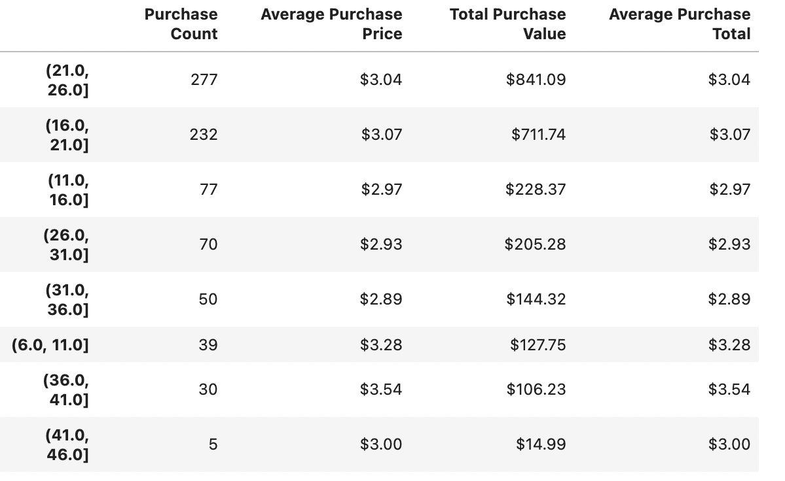

<!DOCTYPE html>
<html>

<h3>
    pandas-challenge

<h2>
    Player Count

    Heroes of Pymoli has 576 players which use the in game Marketplace.
    

<h2>
    Purchasing Analysis (Total)
    
     
    
<h2>
    Gender Demographics
    
     
    
<h2>
    Purchasing Analysis (Gender)
    
     

<h2>
    Age Demographics

     
     

<h2>
    Top Spenders
    
     

<h2>
    Most Popular Items

     
<h2>
    Most Profitable Items
   
     
    
    
</html>