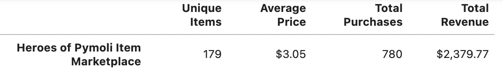
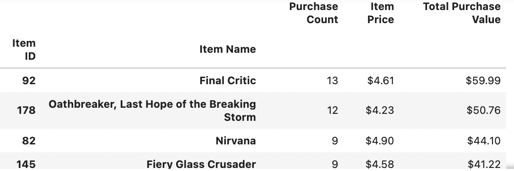

<!DOCTYPE html>
<html>

<h2>
    Player Count
</h2>
    

    Heroes of Pymoli has 576 players which use the in-game Marketplace.
    

<h2>
    Purchasing Analysis (Total)
</h2>
     
    
<h2>
    Gender Demographics
</h2>
    

        We can see that male is the primary gender option choosen for accounts, which might suggest a factor preventing a more traditional spread of data over a gender spectrum.
    
   </img>
    

   
</h2>    
<h2>
    Purchasing Analysis (Gender)
</h2>    
     

<h2>
    Age Demographics
</h2>
    

    The age range of players that the most fall into is 22 to 26 years old, with 17 to 21 being a close second. If we want to better market to our customers, these would be the ages to target. 
         </img>
         </img>
    
    

<h2>
    Top Spenders
</h2>    
     

<h2>
    Most Popular Items
</h2>
     
<h2>
    Most Profitable Items
</h2>   
    

        The item price variance is low for these items, making the number of purchases the most important factor in raising revenue. If we assume more players means more purchases then focusing on raising and maintaining the player count should be our goal, with limitations placed by cost of operation to maintain profit. 
         
    

    
   
    
</html>
